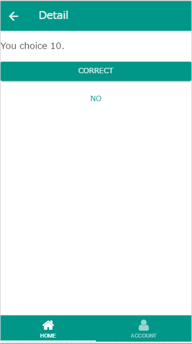

Tab-navigation template for monaca
---

タブによるページ切り替えと、ナビゲーションによるPush/Popの2つの画面遷移を組み合わせたテンプレートです。

# スクリーンショット
iOS  


Android  


# インストール
1. [zip download](https://github.com/kuluna/monaca-template-tab-navigation/archive/master.zip)
1. monacaにログインし、Import Projectをクリック
1. 「プロジェクトのパッケージをアップロード」をクリックし、ダウンロードしたzipをmonacaにアップロード

# 機能
- タブとナビゲーションの組み合わせ
- 画面遷移時の値渡し
- AngularJSのhttp APIを使ったREST API通信
- Nifty Mobile Backendモジュールの組み込み

# 構成
画面のヒエラルキー

```
index.html(Tab)
│
├─view/home.html(Navigation)
│  ├─master.html
│  ├─detail.html
│
└─view/account.html
```

`index.html`にタブタグが、`view/home.html`にナビゲーションタグがあります。これらを起点として画面遷移が行われます。

Tabは`view/home.html`と、`view/account.html`の表示をスイッチします。Navigationは`view/master.html`と`view/detail.html`の表示を切り替えます。  
アプリが開いている間、`view/home.html`は画面遷移の状態を保持します。よってdetailを表示している状態でAccountタブに切り替えても、もう一度Homeタブに切り替えた時detailが開かれた状態のままとなります。  
__この挙動はスマートフォンネイティブアプリの動作と同じため、仕様です。__

# ライセンス
MIT License.
